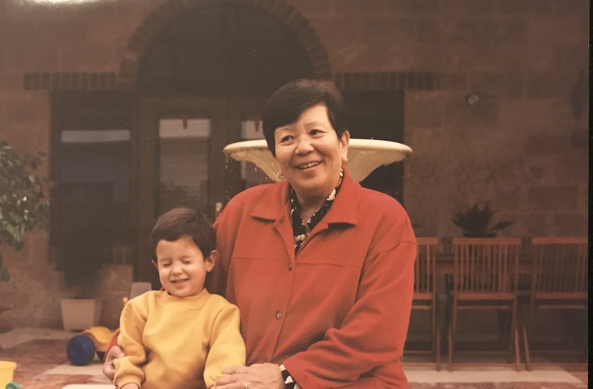

# Peranakan Cuisine

### Who are the Peranakans?

Peranakans, also known as the Baba-Nyonya, are the descendants of Chinese immigrants who settled in the British Straits Settlements of Malaya and the Dutch East Indies during from the 1500s onward. They developed a unique culture, blending Chinese and local customs, language, and traditions. Peranakan culture is especially dominant in the former Straits Settlements of Penang, Medan, Malacca and Singapore (my maternal grandfather and grandmother hail from the latter two, respectively).

The Peranakans are a multiracial community with a large diaspora across many modern-day Southeast Asian countries, formed by waves of immigration and Chinese-local hybridization over many centuries. Individual family histories are complex and self-identification with "Chineseness" varies widely. My family identifies as Peranakan and ethnically Chinese (Straits Chinese), though our traditions, culture and language differ substantially from that of the modern People's Republic. Our language blends Malay, Hokkien, English and other dialect vocabulary in varying proportions, with a mostly Chinese-based grammar.

### Why is our cuisine so unique?

Peranakan (Nyonya) [cuisine](https://www.cnn.com/travel/article/peranakan-nyonya-food-intl-hnk/index.html) is the result of the centuries of natural transformation and [fusion]() between Chinese and Malay culinary traditions. Our cuisine is distinct from contemporary Malaysian cuisine, and the Eight Great Traditions (八大菜系) of Chinese cuisine. It combines ingredients, techniques and ideas of Chinese, Malay, Javanese, South Indian repertoires. There is no one dominant flavor profile -- tangy, spicy, herbal, umami all feature in some way. Our most well-known dish internationally is [laksa](https://www.scmp.com/magazines/style/travel-food/article/3021158/singapore-laksa-vs-nyonya-laksa-which-original-and-how) (and [kuehs](https://johorkaki.blogspot.com/2021/05/history-origins-of-different-types-of.html) may have gained some notoriety from the film Crazy Rich Asians) but there is so much more.

### What are our main ingredients?

* Asam chwee (tamarind water)
* Bee hoon (米线) - rice vermicelli noodles 
* Belacan (fermented shrimp paste)
* Buah keluak (pangium seed)
* Buak keras (candlenut)
* Butterfly pea flower (bunga telang)
* Coconut cream (santan)
* Coriander seeds/powder (ketumbar)
* Dried chilli paste
* Fresh turmeric (kunyit)
* Fresh galangal (lengkuas)
* Gula melaka (coconut flower palm sugar)
* Hae bi (虾米) - dried small shrimps
* Hae ko (虾酱) - sweet shrimp paste
* Hee pio (鱼肚) - fish maw
* Jicama (bang kuang) 
* Kaffir lime leaf (limau purut)
* Lemongrass (Serai)
* Light and dark soy sauces (生抽、老抽)
* Pandan leaf 
* Pulut (glutinous rice) - for kuehs
* Tau cheo or taucu (豆酱) - fermented bean paste

### Family recipes

Below are some dishes that are made regularly in my family. Note that Peranakan cuisine is extensive, so a single family might cook 10-20% of the repertoire and specialize in only a few dishes. Each family is also likely to have a unique take on the dishes it does cook. 

Over time, I'm attempting to compile recipes for most of these dishes (there is still much work to be done). One should bear in mind that "[agak agak](https://medium.com/inaclaypot/agak-agak-51c65d459a6e)" (intuition) is the guiding principle of most of our cooking, and there are no singular "correct" recipes with exact measurements. It is more an art than a science, and the goal should be to strive for balance of flavor in each dish. 

* **Achar** - pickled cabbage, cucumber, and carrots
* **Ang (lek) tau tng** - sweet red (green) bean soup with miniature rice balls
* **Ayam pongteh** - chicken and potato stew with fermented bean sauce and palm sugar
* **[Ayam sioh](recipes/ayam-sioh.md)** - chicken with coriander and tamarind
* **Babi asam** - spicy pork stew with tamarind juice 
* **Bak chang (肉粽)** - our take on Chinese zongzi, made with butterfly pea flower and coriander seeds
* **Buah keluak** - pangium seeds cooked with a basic rempah (spice paste), served as a side dish with rice
* **Chap chye** - stewed vegetables (cabbage, shiitake mushroom, carrot and black fungus) with lily buds and beancurd skin
* **Ikan asam pedas nenas** - tangy and spicy fish curry with pineapple
* **Kaya** - coconut and egg jam, served with toast and butter
* **Kiam chye tng** **(咸菜汤)** - sour vegetable soup with pork bones and tamarind, eaten with sambal belacan (hot chilli)
* **Kuah hee pio** - fish maw soup with cabbage and pork balls 
* **Kueh pie tee** - pastry shells with jicama and shrimp filling
* **Kueh salat** - blue pea glutinous rice and pandan cake
* **Mee siam** - tangy vermicelli noodles with shrimp, egg and chives
* **Nyonya Hokkien mee** - light sauce noodles with an egg gravy
* **Popiah (薄餅)** - rolled crepe with jicama, peanut, shrimp and bean sprout filling

For dishes not listed here, I might be able to point you toward someone with the appropriate specialist knowledge. There are, however, several Peranakan recipe sharing groups on Facebook which I encourage you to join if you are interested in the cuisine more broadly.

*My grandmother, Shirley Tay (nee Cheong) - below - taught me most of these recipes. I am working to document and preserve her knowledge, and bring awareness of Peranakan cuisine to a wider audience.*

