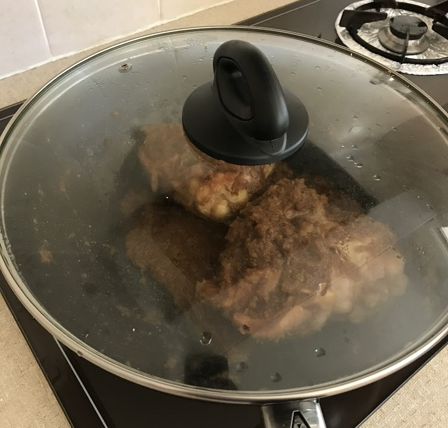
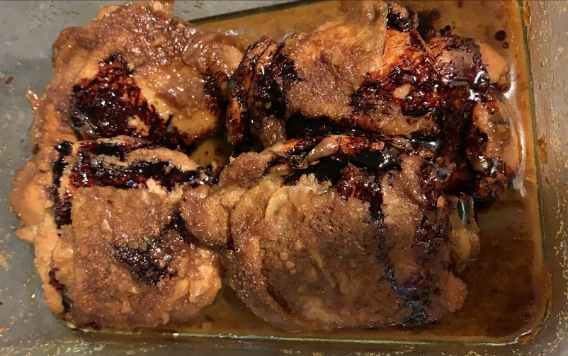

# Ayam Sioh

This is a dish my grandmother would make regularly. It uses few ingredients but the interplay of coriander and tamarind is complex and deeply flavourful. The Malay word "sioh" means "black" or "dark" in English, and refers in this case to the dark color of the gravy.

### Ingredients

* 12 pieces chicken (drumsticks cut into two)
* 1 cup shallots, pounded (blended) - can substitute onion
* 4-5 tbsp ketumbar (coriander) powder, fine
* Asam chwee (tamarind water)
* Approx 1 tbsp vinegar
* 1 tbsp soy sauce
* Kecap manis and/or gula melaka to taste (for sweetness)

### Method 

*Note: must agak agak.*

1. Brown chicken and set aside.
2. Brown shallots/onion in the same pan.
3. Add back the chicken and all other ingredients, and simmer until soft and gravy is thick.
4. Add 1 tbsp (approx) of hot oil at the end

  

    
    
<strong>Cover with lid to cook the chicken faster.</strong>

  

  

    
    
<strong>End result, w/ some kecap manis drizzled over the top.</strong>

  

