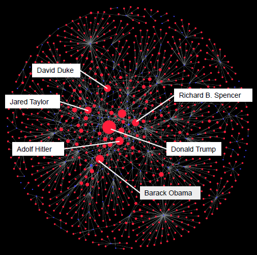
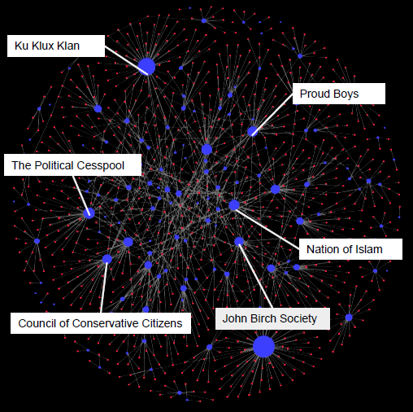

# Leveraging Wikipedia data to assess public awareness of U.S. hate groups

*With Louis Jarvers, Jiaxi Liu, Leia Song, and Michelle Strayer.*

The report focuses on using Wikipedia data as a proxy for public knowledge to assess public awareness of US hate groups. The report uses Social Network Analysis (SNA) to visualize connections between hate groups and individuals, Natural Language Processing (NLP) and Latent Dirichlet Allocation (LDA) to analyze article content, and time series analysis to examine view data as a public attention proxy. 

The findings emphasize the applicability of these tools to other fields and dimensions of research, and present potential policy implications for their use. The report also examines potential sources of bias in Wikipedia data, such as content edits, availability, and funding model, and explores the role of public knowledge in understanding and preventing hate crimes and countering violent extremism.

SNA helps to identify common references between organizations, and centrality of networks (center vs. periphery) represents interconnectedness of groups in the light of public knowledge. NLP techniques can be used to add "color", identifying groups based on topic and lexical similarity. The report also finds that public attention fluctuates around national news coverage, and most peaks in public attention around news events were relatively short-lived, with the exception of the Storming of the United States Capitol in January 2021.

View the full report **[here](pages-assets/wikihate/JKLSS-report.pdf)** along with the accompanying **[slides](pages-assets/wikihate/JKLSS-slides.pdf).** The graph visualizations may also be accessed here ([second](https://bit.ly/3g4HJjP) and [third](https://bit.ly/3uNzVXH) level nodes).

  

    
    
<strong>Persons by in-degree.</strong>

  

  

    
    
<strong>Groups by out-degree.</strong>

  

